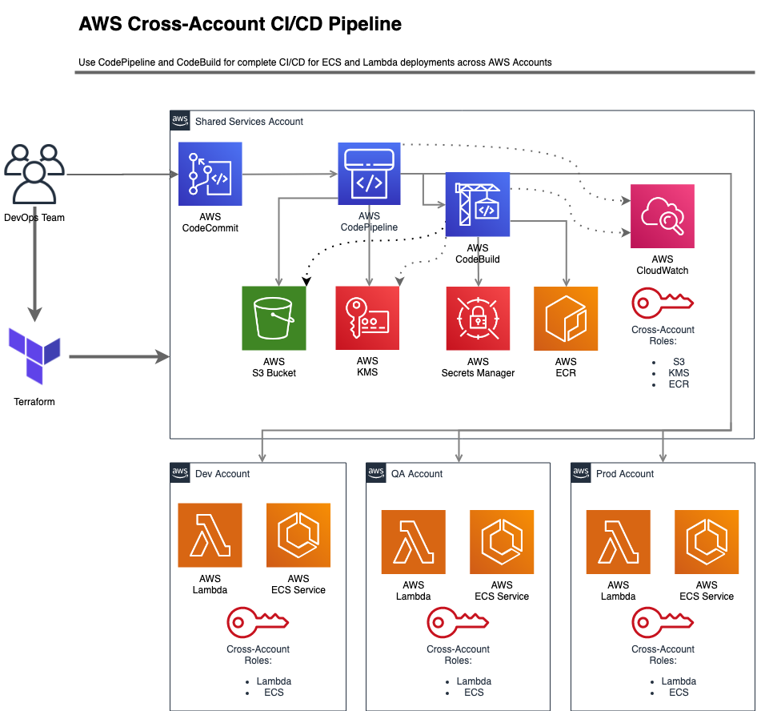
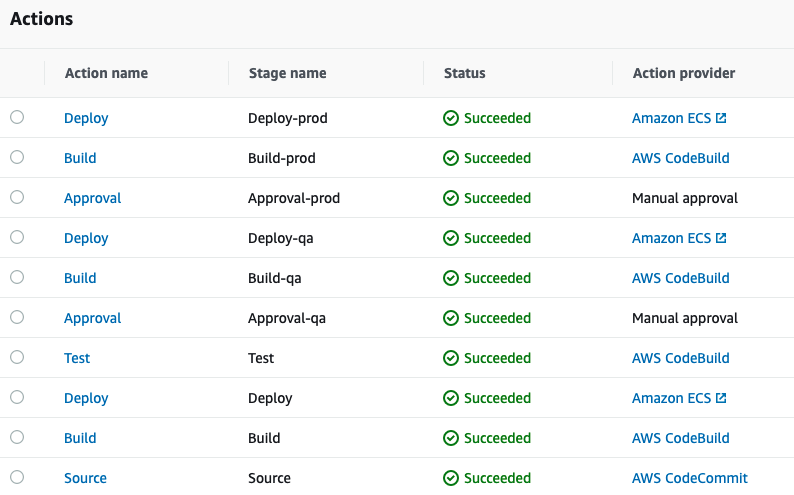
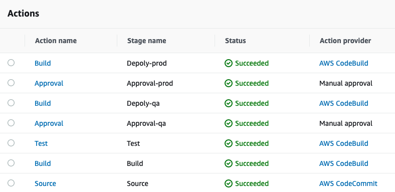

In this blog post, we describes how to set up a cross account continuous integration and continuous delivery (CI/CD) pipeline on AWS. A CI/CD pipeline helps you automate steps in your software delivery process, such as initiating automatic builds, artifacts store, integration testing and then deploying to Amazon ECS Service or Lambda function or other AWS Services.

We uses AWS CodePipeline, a service that builds, tests, and deploys your code every time there is a code change, along side CodeBuild for specific integration testing and deploying to AWS services that is not yet supported by AWS CodePipeline.

We Uses CodePipeline to orchestrate each step in the release process, such as get the source code from Github or CodeCommit, run integration testing, deploying to DEV environment, manual approval for higher environments such as QA and PROD.

One thing to mention that most organizations create multiple AWS accounts because they provide the highest level of resource and security isolation, this introduce a challenge to creates cross account access between different AWS services, so to manage multiple AWS accounts we have the following accounts:

- Shared Services account: this account contains S3 buckets, CodeCommit repositories, CodeBuild Projects, CodePipeline pipelines, CloudTrail, Config, Transit Gateway and other shared services between accounts. Also this account contains cross account roles to access Dev, QA and Prod accounts, this allows CodePipeline and CodeBuild to access their services and resources for the pipeline to succeed.

- Dev account: this account contains a sandbox for developers and dev environment for software, the Shared Services account have specific access to this account, such as ECS services and Lambda functions.

- QA account: this account have the test environment for making sure that software works as expected.

- Prod account: this account have the production environment.

One note to mention that we are avoiding hard coded secrets values and use AWS Secrets manager as much as possible to retrieve passwords, API keys or other sensitive data.

# Diagram



# ECS Service CI/CD pipeline using CodePipeline

Before you can use CodePipeline to update you ECS service in targets account, there are set of permissions including resource based policies and cross account roles needs to setup first, after that, CodePipeline supports updating ECS Services in local account or targets accounts, note that you can use CodeDeploy for more detail deployments types, but for now we are using the simple CodePipeline deployment.

## Cross Account Access Perquisites

When using CodePipeline, or any other AWS services, you need to make sure that permissions to access target services or accounts are permitted, and vise versa, target accounts needs to access AWS resources in the automation or shared services account, we can achieve such access using cross accounts roles and resource based policies.

### Resource based policies

CodePipeline uses S3 bucket as artifact store, and use a KMS key to encrypt these artifacts, in order other accounts and their services to access this s3 buckets, we need first to creates a CMK KMS key, since account KMS key can't be access from other accounts, so CMK allow us to use resource based policy and allow external principals (roles, or root access from target account) which in our case are the dev, qa and prod accounts to access this artifact store bucket, Beside that we need to use S3 bucket policy (resource based policy) to allow access from external principals, this way, we can make sure that dev, qa and prod accounts can access artifact s3 bucket and use CMK KMS key to decrypt the content and use it.

Same approach will be followed for ECR, we will update it's resource based policy to allow ECS services in dev, qa and prod accounts to pull the image and use it with containers definitions.

#### ECR resource based policy

In Shared Service account update ECR Policy to allow access from dev, qa and prod accounts.

```terraform
variable "ecr_policy_identifiers" {
  description = "The policy identifiers for ECR policy."
  type        = list(string)
  default     = []
}

data "aws_iam_policy_document" "ecr" {
  statement {
    sid    = "ecr"
    effect = "Allow"

    actions = [
      "ecr:*"
    ]

    principals {
      type        = "AWS"
      identifiers = var.ecr_policy_identifiers
    }

  }
}

resource "aws_ecr_repository_policy" "this" {
  repository = aws_ecr_repository.this.name
  policy     = data.aws_iam_policy_document.ecr.json
}

```

#### KMS resource based policy

In Shared Service account update KMS Policy to allow access from dev, qa and prod accounts.

```terraform
variable "kms_policy_identifiers" {
  description = "The policy identifiers for kms policy."
  type        = list(string)
  default     = []
}

data "aws_iam_policy_document" "kms" {
  statement {
    sid    = "kms"
    effect = "Allow"

    actions = [
      "kms:*"
    ]

    principals {
      type        = "AWS"
      identifiers = var.kms_policy_identifiers
    }

  }
}

resource "aws_kms_key" "this" {
  ...
  policy                   = data.aws_iam_policy_document.kms.json
}
```

#### S3 resource based policy

In Shared Service account update S3 Policy to allow access from dev, qa and prod accounts, and make sure you are using the CMK KMS key you created with S3 bucket.

```terraform

variable "s3_policy_identifiers" {
  description = "The policy identifiers for s3 policy."
  type        = list(string)
  default     = []
}

data "aws_kms_key" "s3" {
  key_id = var.kms_master_key
}

data "aws_iam_policy_document" "s3" {
  statement {
    sid    = "s3"
    effect = "Allow"
    principals {
      identifiers = var.s3_bucket_policy_identifiers
      type        = "AWS"
    }
    actions = [
      "s3:Get*",
      "s3:List*",
      "s3:Put*"
    ]
    resources = [
      "arn:aws:s3:::${local.bucket_name}",
      "arn:aws:s3:::${local.bucket_name}/*"
    ]
  }
}

resource "aws_s3_bucket_policy" "s3" {
  ...
  policy     = data.aws_iam_policy_document.s3.json
}

```

### Cross Account roles

After we setup our resource based policies for S3, KMS and ECR, we need to allow CodePipeline in Shared Service account to access ECS Service in dev, qa and prod accounts, to do this, we need cross account roles in dev, qa and prod accounts that allow shared service account to assume this role with the appropriate permissions added to these roles, and on the other hand we need policy in shared service account that allow assume to that roles, for example we can attach a policy to the CodePipeline role to allow it to assume targets roles. Now after all of that, we can use `role_arn` to assume roles in targets accounts to update ECS services.

You need to create cross account role in dev, qa and prod, and you need to add a policy to allow CodePipeline role to assume these roles.

```terraform
principal_arns = ["arn:aws:iam::SVC_ACCOUNT_ID:root"]

data "aws_iam_policy_document" "assume" {

  statement {
    effect = "Allow"

    principals {
      type        = "AWS"
      identifiers = var.principal_arns
    }

    actions = ["sts:AssumeRole"]
  }
}

```

After that you can use these roles with CodePipeline in Shared Service account.

```terraform
  stage {
    name = "Deploy-qa"

    action {
      name            = "Deploy"
      category        = "Deploy"
      owner           = "AWS"
      provider        = "ECS"
      input_artifacts = ["image_definitions_qa"]
      version         = "1"
      role_arn        = var.qa_role_arn // assume role

      configuration = {
        ClusterName = var.ecs_cluster_name
        ServiceName = var.ecs_service_name
        FileName    = "image_definitions.json"
      }
    }
  }
```

### Success Run for ECS CI/CD pipeline



# Lambda functions CI/CD pipeline using CodePipeline and CodeBuild.

Lambda functions updating is different from ECS Service, there is no direct way to do it with CodePipeline, thus we use CodeBuild project, and from there we assume into cross accounts roles we mentioned earlier and use aws cli to update Lambda versions and aliases based on the pipeline. a simple CodeBuild `buildspec` file could be as follows:

```bash
version: 0.2
phases:
  pre_build:
    commands:
      - aws sts get-caller-identity
      - TEMP_ROLE=`aws sts assume-role --role-arn ${assume_role_arn} --role-session-name test --region ${region} --endpoint-url https://sts.${region}.amazonaws.com`
      - export TEMP_ROLE
      - echo $TEMP_ROLE
      - aws sts get-caller-identity
      - export AWS_ACCESS_KEY_ID=$(echo "$${TEMP_ROLE}" | jq -r '.Credentials.AccessKeyId')
      - export AWS_SECRET_ACCESS_KEY=$(echo "$${TEMP_ROLE}" | jq -r '.Credentials.SecretAccessKey')
      - export AWS_SESSION_TOKEN=$(echo "$${TEMP_ROLE}" | jq -r '.Credentials.SessionToken')
      - echo $AWS_ACCESS_KEY_ID
      - echo $AWS_SECRET_ACCESS_KEY
      - echo $AWS_SESSION_TOKEN
      - echo Enter pre_build phase on `date`
      - pip install awscli --upgrade --user
      - echo `aws --version`
      - cd lambda
      - zip lambda.zip ${lambda_python_file_name}
  build:
    commands:
      - echo Enter post_build phase on `date`
      - aws lambda update-function-code --function-name ${lambda_function_name} --zip-file fileb://lambda.zip --region ${region}
      - LAMBDA_VERSION=$(aws lambda publish-version --function-name ${lambda_function_name} --region ${region} | jq -r '.Version')
      - echo $LAMBDA_VERSION
      - aws lambda update-alias --function-name ${lambda_function_name} --name dev --region ${region} --function-version $LAMBDA_VERSION
artifacts:
    files:
        - lambda/lambda.zip
    discard-paths: yes
```

When run this CodeBuild within CodePipeline, you can test, package, publish version and update you alias, if anything goes wrong, simply jump back to working version.

## Success Run for Lambda CI/CD pipeline

