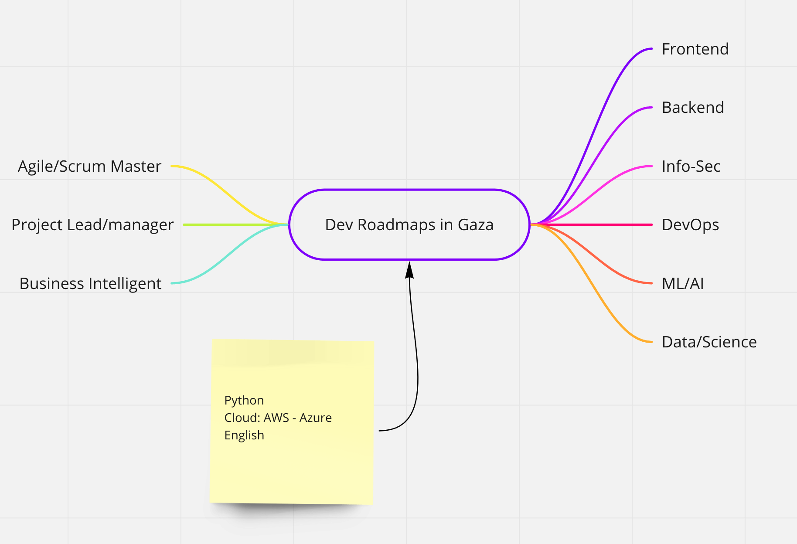

In Gaza strip, we are lacking a good roadmaps for computer engineers and IT developers, we should be able to match world wide requirements and follows the trends.

This is a simple map of what we need to focus on, and what roadmaps should be introduced to fresh graduates and junior developers.

## Diagram

