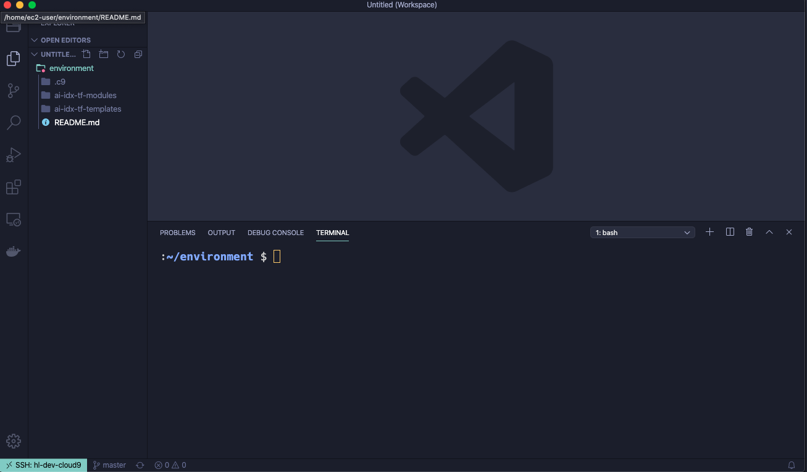

There are great benefits from using Cloud9, especially with Terraform, it’s super-fast since the connection to AWS API happens internally, I was facing terraform apply took up to 15 minutes on my machine, now when running the same commands on cloud9 it’s only 15 seconds!

The Cloud9 UI is nice, but you can still VScode with all of your extensions with cloud 9, using remote ssh extension.

## Remote Development using SSH


## How to connect to Cloud9 EC2 instance from local VSCode

1. Create Cloud9 EC2 instance
2. Open port 22 on cloud9 SG from your IP
3. Install ssh remote ext <https://code.visualstudio.com/docs/remote/ssh>
4. Setup SSH key locally

```bash
   ssh-keygen -t ed25519
   cat ~/.ssh/id_ed25519.pub
   [ copy your key]

   nano ~/.ssh/config # add the following
   Host hl-dev-cloud9
    HostName ec2-XX-XXX-XX-XXX.eu-central-1.compute.amazonaws.com
    User ec2-user
    IdentityFile /Users/mohammed/.ssh/id_ed25519_cloud9
```

5. Add Pub Key to Cloud9 EC2 instance.

Login into the EC2 and add your SSH Pub Key

```bash
cat >> ~/.ssh/authorized_keys
[ paste your key here]
```

6. Go to VSCode UI choose remote ssh machines and choose your cloud9 instance



## Cloud9 Instance: Setup AWS CodeCommit Access, Install Terraform and Terragrunt

1. Setup your ENV workflow for AWS Access [~/.aws/config]:

- Git Access https://docs.aws.amazon.com/codecommit/latest/userguide/setting-up-https-unixes.html#setting-up-https-unixes-credential-helper

2. Install Terraform, Terragrunt

## Troubleshooting

**How to solve "Visual Studio Code is unable to watch for file changes in this large workspace" (error ENOSPC)?**

When you see this notification, it indicates that the VS Code file watcher is running out of handles because the workspace is large and contains many files. The current limit can be viewed by running:

`cat /proc/sys/fs/inotify/max_user_watches`

The limit can be increased to its maximum by editing `/etc/sysctl.conf` and adding this line to the end of the file:

`fs.inotify.max_user_watches=524288`

The new value can then be loaded in by running sudo `sysctl -p`.
