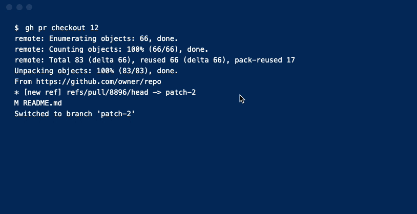
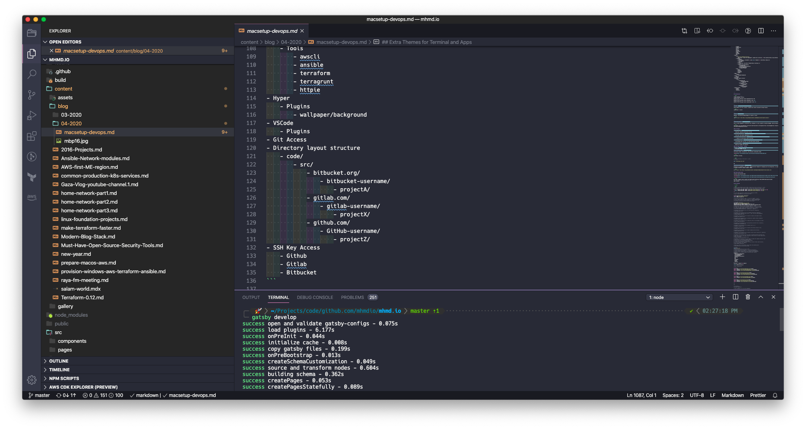
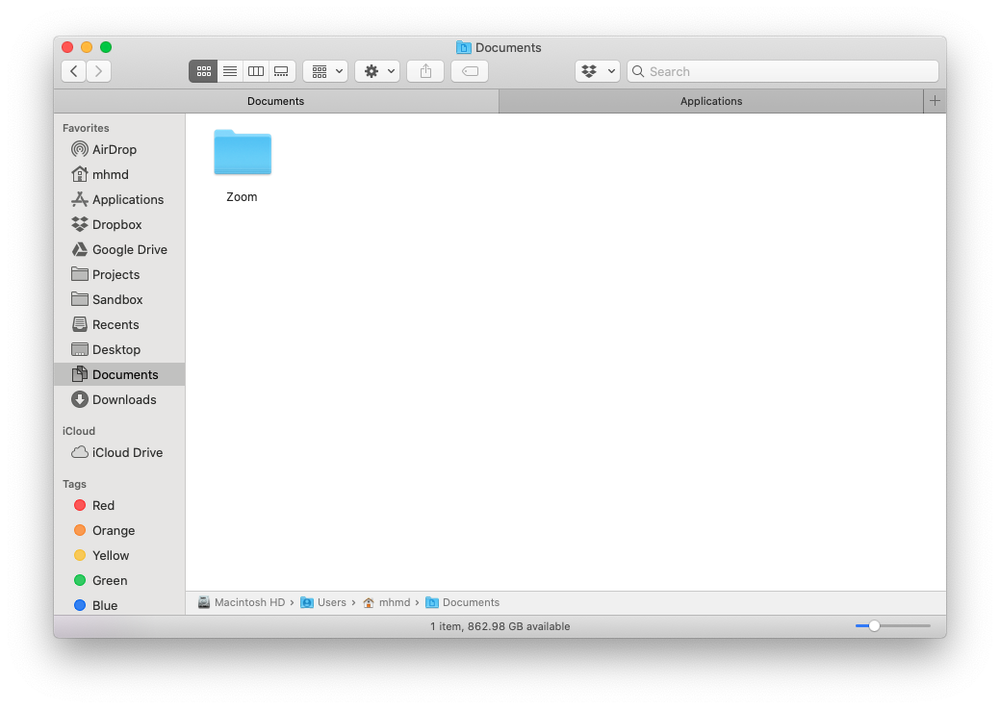
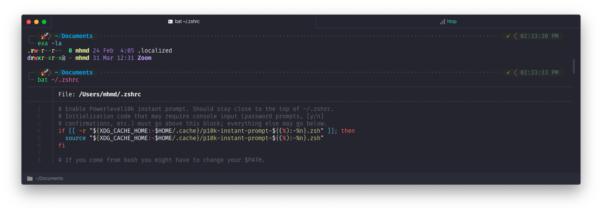

I bought a new MacBookPro 16 inch for my DevOps tasks, and since we are talking about DevOps, we should automate everything, even our own setups, so in this post I'm going to describe my MBP setup automation:

## Note

These are personal preferences, and specific for my use case, please feel free to suggest adding tweaks and apps.

---

## Changelog

| Date       | Change                         |
| ---------- | ------------------------------ |
| 11-04-2020 | Original                       |
| 15-04-2020 | Add Github Cli                 |
| 16-04-2020 | Add Go, Update K8s and Cleanup |
| 17-04-2020 | Add Helm                       |
| 20-04-2020 | Add aws-vault                  |
| 20-04-2020 | Add keka & unrar               |

## Workflow

- **Security**
  - Password Manager: [LastPass]
  - MFA or 2FA: [Authy]
- **Shell**
  - [Zsh]
- **Terminal**
  - [Hyper]
- **Editor**
  - [VSCode]
- **Productivity**
  - [Evernote] & [Notion]
  - [Toggl]
  - [Microsoft To Do]
  - [Trello]
  - [Reader 3]

---

## Idea

- Automate or semi-automate setup.
- Increase productivity.
- Easy on-board for new Team members.
- Unify Tools and Apps.
- Awesome Terminal.
- Awesome Editor.

This list contains most of the tasks we want to automate, as follows:

```bash
- Settings -> manually
    - Update
    - Security settings
    - Mouse settings
    - Dock settings
    - Users settings
    - Hostname
    - Xcode-install
- Essential apps ->  App Store/Brew Downloads
    - Avast
    - Malewarebyts
    - Hyper
    - VSCode
    - Chrome
        - settings
        - plugins
    - brave
        - settings
        - plugins
    - Slack
    - Spark
    - Evernote
    - MS To Do
    - Authy Desktop
    - LasstPass
    - Telegram
    - Whatsapp
    - Evernote
    - Trello
    - SpeedTest
    - Spotify
    - DropBox
    - Google Drive
    - ClickUp
    - Miro
    - Discord
    - Postman
    - SourceTree
    - Skype
    - notable
    - masscode
    - Kap
- Brew
    - Fonts
        - `brew tap homebrew/cask-fonts`
        - [Nerd Fonts - Iconic font aggregator, glyphs/icons collection, & fonts patcher](https://www.nerdfonts.com/)
    -  Zsh Shell
        - Frameworks
            - [Oh My Zsh - a delightful & open source framework for Zsh](https://ohmyz.sh/)
        - Plugins Managers
            - Antigen
        - Prompts
            - [Starship: Cross-Shell Prompt](https://starship.rs/)
        - Plugins
            - zsh-syntax-highlighting
            - zsh-completions
            - zsh-history-substring-search
            - zsh-autosuggestions
            - zsh-apple-touchbar
    - Tools
        - awscli
        - ansible
        - terraform
        - terragrunt
        - httpie
- Hyper
    - Plugins
        - wallpaper/background
- VSCode
    - Plugins
- Git Access
- Directory layout structure
    - code/
        - src/
            - bitbucket.org/
                - bitbucket-username/
                    - projectA/
            - gitlab.com/
                - gitlab-username/
                    - projectX/
            - github.com/
                - GitHub-username/
                    - projectZ/
- SSH Key Access
    - Github
    - Gitlab
    - Bitbucket
```

---

## Accessibility

```bash
# Show Library folder:
chflags nohidden ~/Library
# Show hidden files:
defaults write com.apple.finder AppleShowAllFiles YES
# Show path bar:
defaults write com.apple.finder ShowPathbar -bool true
# Show status bar:
defaults write com.apple.finder ShowStatusBar -bool true
```

---

## xcode - https://developer.apple.com/xcode

Xcode Command Line Tools includes a complete Unix toolkit accessible through Terminal.

```bash
xcode-select --install
```

---

## brew - https://brew.sh

Homebrew - The Missing Package Manager for macOS (or Linux)

```bash
ruby -e "$(curl -fsSL https://raw.githubusercontent.com/Homebrew/install/master/install)"
```

---

## Zsh with plugins - https://www.zsh.org

Zsh is a shell designed for interactive use, although it is also a powerful scripting language, comes by default in macOS Catalina.

```bash
brew install zsh zsh-completions zsh-history-substring-search zsh-navigation-tools zsh-autosuggestions zsh-git-prompt zsh-syntax-highlighting zsh-lovers
```

#### Zsh Plugin Manager - Antigen

- Antigen - https://github.com/zsh-users/antigen
  - The plugin manager for zsh

### Zsh Plugins

- **zsh-completions** - https://github.com/zsh-users/zsh-completions

  - Additional completion definitions for Zsh.

  - [Install with Antigen](https://github.com/zsh-users/antigen):

    - Add `antigen bundle zsh-users/zsh-completions` to your `~/.zshrc`.

  - [Install with oh-my-zsh](http://github.com/robbyrussell/oh-my-zsh):

    - Clone the repository inside your oh-my-zsh repo:

      ```bash
      git clone https://github.com/zsh-users/zsh-completions ${ZSH_CUSTOM:=~/.oh-my-zsh/custom}/plugins/zsh-completions
      ```

    - Enable it in your `.zshrc` by adding it to your plugin list and reloading the completion:

      ```bash
      plugins=(… zsh-completions)
      autoload -U compinit && compinit
      ```

- **zsh-syntax-highlighting** - https://github.com/zsh-users/zsh-syntax-highlighting

  - Fish shell like syntax highlighting for Zsh

- **zsh-history-substring-search** - https://github.com/zsh-users/zsh-history-substring-search

  - 🐠 ZSH port of Fish history search (up arrow)

- **zsh-navigation-tools** - https://github.com/psprint/zsh-navigation-tools

  - Curses-based tools for Zsh, e.g. multi-word history searcher

- **zsh-apple-touchbar** - https://github.com/zsh-users/zsh-apple-touchbar

  - Make your touchbar more powerful.

## Zsh starship prompt - https://starship.rs

Cross-shell minimal, blazing-fast, and infinitely customizable prompt.


```bash
brew install starship
```

```bash
# Add the following to the end of ~/.zshrc:
# ~/.zshrc

eval "$(starship init zsh)"
```

OR

## Oh My Zsh with plugins - https://ohmyz.sh

Oh My Zsh is a delightful, open source, community-driven framework for managing your Zsh configuration. It comes bundled with thousands of helpful functions, helpers, plugins, themes.

```bash
sh -c "$(curl -fsSL https://raw.githubusercontent.com/ohmyzsh/ohmyzsh/master/tools/install.sh)”
```

### Powerlevel10k theme

Configure powerlevel10k theme:


```bash
git clone --depth=1 https://github.com/romkatv/powerlevel10k.git $ZSH_CUSTOM/themes/powerlevel10k
# Set ZSH_THEME="powerlevel10k/powerlevel10k" in ~/.zshrc.
p10k configure
```

## Zsh Settings

`~/.zshrc:`

```bash
# Enable Powerlevel10k instant prompt. Should stay close to the top of ~/.zshrc.
# Initialization code that may require console input (password prompts, [y/n]
# confirmations, etc.) must go above this block; everything else may go below.
if [[ -r "${XDG_CACHE_HOME:-$HOME/.cache}/p10k-instant-prompt-${(%):-%n}.zsh" ]]; then
  source "${XDG_CACHE_HOME:-$HOME/.cache}/p10k-instant-prompt-${(%):-%n}.zsh"
fi

# If you come from bash you might have to change your $PATH.
# export PATH=$HOME/bin:/usr/local/bin:$PATH

# Path to your oh-my-zsh installation.
export ZSH="/Users/mhmd/.oh-my-zsh"
source $HOME/.aliases.zsh

# Set name of the theme to load --- if set to "random", it will
# load a random theme each time oh-my-zsh is loaded, in which case,
# to know which specific one was loaded, run: echo $RANDOM_THEME
# See https://github.com/ohmyzsh/ohmyzsh/wiki/Themes

# ZSH_THEME="spaceship"
ZSH_THEME="powerlevel10k/powerlevel10k"
POWERLEVEL10K_LEFT_PROMPT_ELEMENTS=(context dir vcs)
POWERLEVEL10K_RIGHT_PROMPT_ELEMENTS=(root_indicator background_jobs)
# Set list of themes to pick from when loading at random
# Setting this variable when ZSH_THEME=random will cause zsh to load
# a theme from this variable instead of looking in ~/.oh-my-zsh/themes/
# If set to an empty array, this variable will have no effect.
# ZSH_THEME_RANDOM_CANDIDATES=( "robbyrussell" "agnoster" )

# Uncomment the following line to use case-sensitive completion.
# CASE_SENSITIVE="true"

# Uncomment the following line to use hyphen-insensitive completion.
# Case-sensitive completion must be off. _ and - will be interchangeable.
# HYPHEN_INSENSITIVE="true"

# Uncomment the following line to disable bi-weekly auto-update checks.
# DISABLE_AUTO_UPDATE="true"

# Uncomment the following line to automatically update without prompting.
# DISABLE_UPDATE_PROMPT="true"

# Uncomment the following line to change how often to auto-update (in days).
# export UPDATE_ZSH_DAYS=13

# Uncomment the following line if pasting URLs and other text is messed up.
# DISABLE_MAGIC_FUNCTIONS=true

# Uncomment the following line to disable colors in ls.
# DISABLE_LS_COLORS="true"

# Uncomment the following line to disable auto-setting terminal title.
# DISABLE_AUTO_TITLE="true"

# Uncomment the following line to enable command auto-correction.
# ENABLE_CORRECTION="true"

# Uncomment the following line to display red dots whilst waiting for completion.
# COMPLETION_WAITING_DOTS="true"

# Uncomment the following line if you want to disable marking untracked files
# under VCS as dirty. This makes repository status check for large repositories
# much, much faster.
# DISABLE_UNTRACKED_FILES_DIRTY="true"

# Uncomment the following line if you want to change the command execution time
# stamp shown in the history command output.
# You can set one of the optional three formats:
# "mm/dd/yyyy"|"dd.mm.yyyy"|"yyyy-mm-dd"
# or set a custom format using the strftime function format specifications,
# see 'man strftime' for details.
# HIST_STAMPS="mm/dd/yyyy"

# Would you like to use another custom folder than $ZSH/custom?
# ZSH_CUSTOM=/path/to/new-custom-folder

# aliases
alias ls='ls -G'
# Which plugins would you like to load?
# Standard plugins can be found in ~/.oh-my-zsh/plugins/*
# Custom plugins may be added to ~/.oh-my-zsh/custom/plugins/
# Example format: plugins=(rails git textmate ruby lighthouse)
# Add wisely, as too many plugins slow down shell startup.
plugins=(
  fast-syntax-highlighting
  zsh-autosuggestions
  zsh-completions
  history-substring-search
  autojump
  git
  aws
  terraform
  ansible
  docker
  colorize
)
autoload -U compinit && compinit

source $ZSH/oh-my-zsh.sh

# User configuration

## openssl
export PATH="/usr/local/opt/openssl@1.1/bin:$PATH"
export LDFLAGS="-L/usr/local/opt/openssl@1.1/lib:$LDFLAGS"
export CPPFLAGS="-I/usr/local/opt/openssl@1.1/include:$CPPFLAGS"

## sqlite
export PATH="/usr/local/opt/sqlite/bin:$PATH"
export LDFLAGS="-L/usr/local/opt/sqlite/lib:$LDFLAGS"
export CPPFLAGS="-I/usr/local/opt/sqlite/include:$CPPFLAGS"

## python@3.8
export PATH="/usr/local/opt/python@3.8/bin:$PATH"
export LDFLAGS="-L/usr/local/opt/python@3.8/lib:$PATH"

## curl
export PATH="/usr/local/opt/curl/bin:$PATH"
export LDFLAGS="-L/usr/local/opt/curl/lib:$LDFLAGS"
export CPPFLAGS="-I/usr/local/opt/curl/include:$CPPFLAGS"

##

##

# fix hyper 3
#unsetopt PROMPT_SP

# export MANPATH="/usr/local/man:$MANPATH"

# You may need to manually set your language environment
# export LANG=en_US.UTF-8

# Preferred editor for local and remote sessions
# if [[ -n $SSH_CONNECTION ]]; then
#   export EDITOR='vim'
# else
#   export EDITOR='mvim'
# fi

# Compilation flags
# export ARCHFLAGS="-arch x86_64"

# Set personal aliases, overriding those provided by oh-my-zsh libs,
# plugins, and themes. Aliases can be placed here, though oh-my-zsh
# users are encouraged to define aliases within the ZSH_CUSTOM folder.
# For a full list of active aliases, run `alias`.
#
# Example aliases
# alias zshconfig="mate ~/.zshrc"
# alias ohmyzsh="mate ~/.oh-my-zsh"

# To customize prompt, run `p10k configure` or edit ~/.p10k.zsh.
[[ ! -f ~/.p10k.zsh ]] || source ~/.p10k.zsh
```

---

## Fonts - https://www.nerdfonts.com

Nerd Fonts - Iconic font aggregator, collection, and patcher

```bash
brew tap caskroom/fonts
brew cask install font-hack-nerd-font font-hack-nerd-font-mono font-firacode-nerd-font font-firacode-nerd-font-mono
```

---

## CLI Apps

```bash
brew install bash make curl asdf tree jq bat gcal htop youtube-dl unzip speedtest-cli neovim exa graphviz pv fdupes wget glances
# file archiver
brew install unrar
brew cask install keka
# extra
# brew install tig wget lynx httpie xz tmate tldr thefuck lastpass-cli
```

---

## Git - https://git-scm.com

Git is a free and open source distributed version control system designed to handle everything from small to very large projects with speed and efficiency.

```bash
brew install git
git config --global user.name "Mohammed Yahya"
git config --global user.email "123456789@ABCDEF.xyz"
git config --global color.ui auto
```

---

## SSH

```bash
mkdir $HOME/.ssh
chmod 0700 $HOME/.ssh
ssh-keygen -t rsa -b 4096 -C "mbp16 123456789@ABCDEF.xyz"
```

- Go to `https://github.com/settings/keys` and add the new SSH Key

---

## Folder Layout

```bash
mkdir -p Projects/code/{bitbucket.org/{myalmusaddar,mhmdio},gitlab.com/mhmdio,github.com/mhmdio}
mkdir Sandbox
```

Results:

```bash
 🚀  ~/Projects
 tree -d -L 3
.
└── code
    ├── bitbucket.org
    │   ├── mhmdio
    │   ├── myalmusaddar
    │   └── schroeter
    ├── github.com
    │   └── mhmdio
    ├── gitlab.com
    │   └── mhmdio
    └── workspaces
```

---

## DevOps

### Node.js - <https://nodejs.org/en>

Node.js® is a JavaScript runtime built on Chrome's V8 JavaScript engine.

```bash
brew install node nvm yarn
```

### Gatsby - <https://www.gatsbyjs.org/>

Gatsby is a free and open source framework based on React that helps developers build blazing fast websites and apps.

```bash
brew install gatsby-cli
```

### Python - <https://www.python.org>

```bash
brew install python
brew install pyenv pyenv-virtualenv
```

### Go - <https://golang.org/>

```bash
brew install go
```

### AWS

```bash
brew install awscli awslogs aws-shell awsume
brew tap aws/tap
brew install aws-sam-cli
```

#### aws-vault - <https://github.com/99designs/aws-vault>

AWS Vault is a tool to securely store and access AWS credentials in a development environment.

```bash
brew cask install aws-vault
```

#### aws-amplify

```bash
npm install -g @aws-amplify/cli
amplify configure
```

### GitHub Cli - <https://cli.github.com>

Take GitHub to the command line



```bash
brew install github/gh/gh
```

### Ansible - <https://www.ansible.com>

```bash
brew install ansible ansible-lint
```

### HashiCorp - <https://www.hashicorp.com>

```bash
brew install terraform
brew install packer
brew install consul
brew install vault
brew install vagrant vagrant-manager
```

### Terraform Addons

```bash
brew install terraformer terragrunt terraform-docs terraform_landscape iam-policy-json-to-terraform tf-lint
```

### kubernetes - <https://kubernetes.io>

Production-Grade Container Orchestration. Automated container deployment, scaling, and management

```bash
brew install kubernetes-cli
brew install minikube
```

#### miniKube - <https://minikube.sigs.k8s.io/docs/>

minikube quickly sets up a local Kubernetes cluster on macOS, Linux, and Windows.

```bash
brew install minikube
```

#### Helm - <https://helm.sh/>

The package manager for Kubernetes

```bash
brew install helm
```

### Docker - <https://www.docker.com>

Securely build and share any application, anywhere

```bash
brew cask install docker
```

### VirtualBox - https://www.virtualbox.org

VirtualBox is a powerful x86 and AMD64/Intel64 virtualization product for enterprise as well as home use.

```bash
brew cask install virtualbox virtualbox-extension-pack
```

---

## Aliases

### Zsh Aliases

```bash
nvim ~/.zshrc
# Add the following line
source $HOME/.aliases.zsh
```

**`$HOME/.aliases.zsh:`**

```bash
alias zshreload='source ~/.zshrc'             # reload ZSH
alias zchange='code ~/.zshrc'             # reload ZSH

alias gchange='code ~/.gitconfig'             # reload ZSH

alias shtop='sudo htop'                       # run `htop` with root rights
alias grep='grep --color=auto'                # colorize `grep` output
alias ..='cd ..'
alias ...='cd ../..'
alias ....='cd ../../..'
alias less='less -R'

alias rm='rm -i'                              # confirm removal
alias cp='cp -i'                              # confirm copy
alias mv='mv -i'                              # confirm move
alias cal='gcal --starting-day=1'             # print simple calendar for current month
alias weather='curl v2.wttr.in'               # print weather for current location (https://github.com/chubin/wttr.in)
```

### Git Aliases

`code .gitconfig`

```bash
[core]
	excludesfile = /Users/mhmd/.gitignore_global
[difftool "sourcetree"]
	cmd = opendiff \"$LOCAL\" \"$REMOTE\"
	path =
[mergetool "sourcetree"]
	cmd = /Applications/Sourcetree.app/Contents/Resources/opendiff-w.sh \"$LOCAL\" \"$REMOTE\" -ancestor \"$BASE\" -merge \"$MERGED\"
	trustExitCode = true
[user]
	name = Mohammed Yahya
	email = my.almusaddar@gmail.com
[color]
	ui = auto

[alias]
  a = add																		# Add file contents to the index
  ai = add --interactive										# Add modified contents in the working tree interactively to the index.
  ##############
  b = branch
  ba = branch --all                     		# List both remote-tracking branches and local branches.
  bav = branch --all --verbose 							# When in list mode, show sha1 and commit subject line for each head, along with relationship to upstream branch (if any)
  bd = branch --delete 											# Delete a branch. The branch must be fully merged in its upstream branch, or in HEAD if no upstream was set with --track or --set-upstream-to.
  bdd = branch -D 													# Shortcut for --delete --force.
  bm = branch --move												# Move/rename a branch and the corresponding reflog.
  bmm = branch -M 													# Shortcut for --move --force.
  br = branch --remotes 										# List or delete (if used with -d) the remote-tracking branches.
  ##############
  c = commit 																# Record changes to the repository
  ca = commit --all													# Tell the command to automatically stage files that have been modified and deleted, but new files you have not told Git about are not affected.
  cm = commit -m 														# Use the given <msg> as the commit message.
  cam = commit -am 													# Shortcut for --all and -m
  cem = commit --allow-empty -m							# Allows to create a commit without any files modified
  cd = commit --amend												# Replace the tip of the current branch by creating a new commit.
  cad = commit --all --amend								# Shortcut for --amend and --all
  cadne = commit --all --amend --no-edit		# Amends a commit without changing its commit message.
  ##############
  cl = clone 																# Clone a repository into a new directory
  cld = clone --depth 1											# Create a shallow clone with a history truncated to the specified number of commits.
  ##############
  cp = cherry-pick													# Apply the changes introduced by some existing commits
  cpa = cherry-pick --abort									# Cancel the operation and return to the pre-sequence state.
  cpc = cherry-pick --continue 							# Continue the operation in progress using the information in .git/sequencer. Can be used to continue after resolving conflicts in a failed cherry-pick or revert.
  cps = cherry-pick --skip 									# Skip the current commit and continue with the rest of the sequence.
  ##############
  d = diff																	# Show changes between commits, commit and working tree, etc
  di = !"d() { git diff --patch-with-stat HEAD~$1; }; git diff-index --quiet HEAD -- || clear; d" 	# `git di $number` shows the diff between the state `$number` revisions ago and the current state
  dt = difftool															# Show changes using common diff tools
  ##############
  f = fetch 																# Download objects and refs from another repository
  fo = fetch origin 												# Update the remote-tracking branches
  fu = fetch upstream												# Fetch the branches and their respective commits from the upstream repository.
  ##############
  fk = fsck 																# Verifies the connectivity and validity of the objects in the database
  ##############
  g = grep -p																# Print lines matching a pattern
  ##############
  l = log --oneline													# Show commit logs, the commit message is prefixed with this information on the same line.
  lg = log --oneline --graph --decorate			# Draw a text-based graphical representation of the commit history on the left hand side of the output.
  lgs = !"git log --pretty=format:"%C(yellow)%h\\ %ad%Cred%d\\ %Creset%s%Cblue\\ [%cn]" --decorate --date=short" 													# SHA + date + Commit message + author
  lgc = !"git log --pretty=format:"%C(yellow)%h%Cred%d\\ %Creset%s%Cblue\\ [%cn]" --decorate --numstat"																		# SHA + Commit message + author + changed files
  lgt = !"git log --graph --pretty='%Cred%h%Creset -%C(yellow)%d%Creset %s %Cgreen(%cr) %C(bold blue)<%an>%Creset' --abbrev-commit --all" # As tree: SHA + Commit message + Time ago + author
  ##############
  ls = ls-files															# Show information about files in the index and the working tree
  lsm = ls-files --modified									# Show modified files in the output
  lss = ls-files --stage										# Show staged contents' mode bits, object name and stage number in the output.
  ##############
  m = merge 																# Join two or more development histories together
  ma = merge --abort												# Abort the current conflict resolution process, and try to reconstruct the pre-merge state.
  mc = merge --continue											# After a git merge stops due to conflicts you can conclude the merge by running git merge --continue
  mq = merge --quit													# Forget about the current merge in progress. Leave the index and the working tree as-is.
  mm = merge master 												# Merge 'master' branch to the current branch.
  ##############
  o = checkout 															# Switch branches or restore working tree files.
  om = checkout master											# Switch branch to master.
  ob = checkout -b 													# Create and switch to a new branch
  ##############
  pr = prune --verbose --progress						# Prune all unreachable objects from the object database. Report all removed objects. Show progress.
  prn = prune --dry-run											# Do not remove anything; just report what it would remove.
  ##############
  ps = push 																# Update remote refs along with associated objects
  psa = push --all 													# Push all branches (i.e. refs under refs/heads/); cannot be used with other <refspec>.
  psf = push --force												# Usually, the command refuses to update a remote ref that is not an ancestor of the local ref used to overwrite it. This flag disables these checks, and can cause the remote repository to lose commits; use it with care.
  psu = push --set-upstream									# For every branch that is up to date or successfully pushed, add upstream (tracking) reference.
  ##############
  pso = push origin													# `origin` is an alias in the system for a particular remote repository. Can be checked by running `git remote -v`.
  psao = push --all origin									# Same as `push --all` but for origin.
  psfo = push --force origin								# Same as `push --force` but for origin.
  psuo = push --set-upstream origin					# Same as `push --set-upstream` but for origin.
  #############
  psom = push origin master 								# Same as `push origin` but for master branch.
  psaom = push --all origin master					# Same as `push --all origin` but for master branch.
  psfom = push --force origin master				# Same as `push --force origin` but for master branch.
  psuom = push --set-upstream origin master # Same as `push --set-upstream origin` but for master branch.
  #############
  pl = pull 																# Fetch from and integrate with another repository or a local branch.
  plr = pull --rebase 											# When true, rebase the current branch on top of the upstream branch after fetching.
  plv = pull --verbose 											# Pass --verbose to git-fetch and git-merge.
  #############
  plo = pull origin 											  # Same as `pull` but for origin.
  plro = pull --rebase origin								# Same as `pull --rebase` but for origin.
  plom = pull origin master									# Same as `pull origin` but for master branch.
  #############
  plu = pull upstream												# Same as `pull` but for upstream.
  plum = pull upstream master								# Same as `pull upstream` but for master branch.
  plrum = pull --rebase upstream master    	# Same as `pull --rebase` but for upstream and master branch.
  #############
  rb = rebase																# Reapply commits on top of another base tip.
  rba = rebase --abort											# Abort the rebase operation and reset HEAD to the original branch.
  rbc = rebase --continue 									# Restart the rebasing process after having resolved a merge conflict.
  rbi = rebase --interactive                # Make a list of the commits which are about to be rebased. Let the user edit that list before rebasing. This mode can also be used to split commits.
  rbs = rebase --skip 											# Restart the rebasing process by skipping the current patch.
  rbin = "!r() { git rebase -i HEAD~$1; }; r" # Interactive rebase with the given number of latest commits.
  #############
  re = reset																# Reset current HEAD to the specified state
  rh = reset HEAD 													# HEAD is defined explicitly
  reh = reset --hard												# Resets the index and working tree. Any changes to tracked files in the working tree since <commit> are discarded.
  rem = reset --mixed												# Resets the index but not the working tree (i.e., the changed files are preserved but not marked for commit) and reports what has not been updated. This is the default action.
  res = reset --soft                        # Does not touch the index file or the working tree at all (but resets the head to <commit>, just like all modes do). This leaves all your changed files "Changes to be committed".
  rehh = reset --hard HEAD									# HEAD is defined explicitly
  remh = reset --mixed HEAD									# HEAD is defined explicitly
  resh = reset --soft HEAD									# HEAD is defined explicitly
  rehom = reset --hard origin/master				# Throw away all my staged and unstaged changes, forget everything on my current local branch and make it exactly the same as origin/master.
  #############
  r = remote																# Manage set of tracked repositories
  ra = remote add 													# Adds a remote named <name> for the repository at <url>.
  rr = remote remove												# Remove the remote named <name>. All remote-tracking branches and configuration settings for the remote are removed.
  rv = remote --verbose											# Be a little more verbose and show remote url after name.
  rn = remote rename												# Rename the remote named <old> to <new>. All remote-tracking branches and configuration settings for the remote are updated.
  rp = remote prune 												# Deletes stale references associated with <name>. By default, stale remote-tracking branches under <name> are deleted, but depending on global configuration and the configuration of the remote we might even prune local tags that haven't been pushed there.
  rs = remote show 													# Gives some information about the remote <name>.
  rao = remote add origin 									# Add new origin.
  rau = remote add upstream									# Add new upstream.
  rro = remote remove origin								# Remove origin.
  rru = remote remove upstream              # Remove upstream.
  rso = remote show origin									# Show current origin.
  rsu = remote show upstream								# Show current upstream.
  rpo = remote prune origin                 # Prune current origin.
  rpu = remote prune upstream								# Prune current upstream.
  #############
  rmf = rm -f																# Remove files from the working tree and from the index. Override the up-to-date check.
  rmrf = rm -r -f														# Same as above + Allow recursive removal when a leading directory name is given.
  #############
  s = status																# Show the working tree status
  sb = status -s -b													# Same as above + Give the output in the short-format. Show the branch and tracking info even in short-format.
  #############
  sa = stash apply													# Like pop, but do not remove the state from the stash list.
  sc = stash clear													# Remove all the stash entries. Note that those entries will then be subject to pruning, and may be impossible to recover.
  sd = stash drop														# Remove a single stash entry from the list of stash entries. When no <stash> is given, it removes the latest one.
  sl = stash list														# List the stash entries that you currently have.
  sp = stash pop														# Remove a single stashed state from the stash list and apply it on top of the current working tree state, i.e., do the inverse operation of git stash push.
  sps = stash push 													# Save your local modifications to a new stash entry and roll them back to HEAD (in the working tree and in the index). The <message> part is optional and gives the description along with the stashed state.
  spsk = stash push -k											# All changes already added to the index are left intact.
  sw = stash show														# Show the changes recorded in the stash entry as a diff between the stashed contents and the commit back when the stash entry was first created. When no <stash> is given, it shows the latest one.
  st = !git stash list | wc -l 2>/dev/null | grep -oEi '[0-9][0-9]*'
  #############
  t = tag																		# Create, list, delete or verify a tag object signed with GPG.
  td = tag --delete													# Delete existing tags with the given names.
  tl = tag --list														# Show verbose output about tags.
  #############
  w = show                                  # Show various types of objects.
  wo = show --oneline												# This is a shorthand for "--pretty=oneline --abbrev-commit" used together.
  wf = show --format=fuller									# Print more extensive info.
  #############
  aliases = !git config -l | grep alias | cut -c 7- # List git aliases
  branches = branch --all 									# List both remote-tracking branches and local branches.
  remotes = remote --verbose 								# Be a little more verbose and show remote url after name.
  contributors = shortlog --summary --numbered	# List contributors with number of commits
  amend = commit --amend --no-edit					# Amend the currently staged files to the latest commit.
  go = "!f() { git checkout -b \"$1\" 2> /dev/null || git checkout \"$1\"; }; f"	# Switch to a branch, creating it if necessary
  fb = "!f() { git branch -a --contains $1; }; f"																	# Find branches containing commit
  ft = "!f() { git describe --always --contains $1; }; f"													# Find tags containing commit
  fc = "!f() { git log --pretty=format:'%C(yellow)%h  %Cblue%ad  %Creset%s%Cgreen  [%cn] %Cred%d' --decorate --date=short -S$1; }; f"				# Find commits by source code
  fm = "!f() { git log --pretty=format:'%C(yellow)%h  %Cblue%ad  %Creset%s%Cgreen  [%cn] %Cred%d' --decorate --date=short --grep=$1; }; f" 	# Find commits by commit message
  dm = "!git branch --merged | grep -v '\\*' | xargs -n 1 git branch -d"	# Remove branches that have already been merged with master (a.k.a. ‘delete merged’)
[commit]
	template = /Users/mhmd/.stCommitMsg

```

---

## mas - https://github.com/mas-cli/mas

📦 Mac App Store command line interface

```bash
brew install mas
```

```bash
mas list

1402042596 AdBlock (1.22.0)
1278508951 Trello (2.11.4)
425424353 The Unarchiver (4.2.0)
1274495053 Microsoft To Do (2.15)
1482454543 Twitter (8.15)
1176895641 Spark (2.5.6)
1295203466 Microsoft Remote Desktop (10.3.8)
568494494 Pocket (1.8.5)
803453959 Slack (4.4.2)
1147396723 WhatsApp (0.4.1302)
747648890 Telegram (6.0)
937984704 Amphetamine (5.0.2)
1153157709 Speedtest (1.10)
```

```bash
mas install 410628904 1278508951 1176895641 937984704 1153157709 1274495053 1482454543
```

---

## Mac CLI - https://github.com/guarinogabriel/Mac-CLI

 macOS command line tools for developers

```bash
sh -c "$(curl -fsSL https://raw.githubusercontent.com/guarinogabriel/mac-cli/master/mac-cli/tools/install)"
```

---

## GUI Apps

```bash
brew cask install hyper visual-studio-code brave-browser slack evernote skitch alfred dropbox google-chrome vlc spotify authy the-unarchiver telegram skype zoomus whatsapp lastpass toggl upwork transmission obs notion sourcetree tunnelblick maccy tyke kap
```

---

## Hyper - https://hyper.is

A terminal built on web technologies

```bash
hyper install hyper-dracula hyper-statusline hyperterm-tab-icons hyperterm-close-on-left hyperterm-paste hyperlinks hypercwd hypertitle
```

`~/.hyper.js:`

```js
// Future versions of Hyper may add additional config options,
// which will not automatically be merged into this file.
// See https://hyper.is#cfg for all currently supported options.

module.exports = {
  config: {
    // choose either `'stable'` for receiving highly polished,
    // or `'canary'` for less polished but more frequent updates
    updateChannel: "stable",

    shell: "/usr/local/bin/zsh",

    // default font size in pixels for all tabs
    fontSize: 15,

    // font family with optional fallbacks
    fontFamily: "FiraCode Nerd Font",

    // default font weight: 'normal' or 'bold'
    fontWeight: "normal",

    // font weight for bold characters: 'normal' or 'bold'
    fontWeightBold: "bold",

    // line height as a relative unit
    lineHeight: 1,

    // letter spacing as a relative unit
    letterSpacing: 0,

    // terminal cursor background color and opacity (hex, rgb, hsl, hsv, hwb or cmyk)
    cursorColor: "rgba(248,28,229,0.8)",

    // terminal text color under BLOCK cursor
    cursorAccentColor: "#000",

    // `'BEAM'` for |, `'UNDERLINE'` for _, `'BLOCK'` for █
    cursorShape: "BLOCK",

    // set to `true` (without backticks and without quotes) for blinking cursor
    cursorBlink: false,

    // color of the text
    foregroundColor: "#fff",

    // terminal background color
    // opacity is only supported on macOS
    backgroundColor: "#000",

    // terminal selection color
    selectionColor: "rgba(248,28,229,0.3)",

    // border color (window, tabs)
    borderColor: "#333",

    // custom CSS to embed in the main window
    css: "",

    // custom CSS to embed in the terminal window
    termCSS: "",

    // if you're using a Linux setup which show native menus, set to false
    // default: `true` on Linux, `true` on Windows, ignored on macOS
    showHamburgerMenu: "",

    // set to `false` (without backticks and without quotes) if you want to hide the minimize, maximize and close buttons
    // additionally, set to `'left'` if you want them on the left, like in Ubuntu
    // default: `true` (without backticks and without quotes) on Windows and Linux, ignored on macOS
    showWindowControls: "",

    // custom padding (CSS format, i.e.: `top right bottom left`)
    padding: "12px 14px",

    // the full list. if you're going to provide the full color palette,
    // including the 6 x 6 color cubes and the grayscale map, just provide
    // an array here instead of a color map object
    colors: {
      black: "#000000",
      red: "#C51E14",
      green: "#1DC121",
      yellow: "#C7C329",
      blue: "#0A2FC4",
      magenta: "#C839C5",
      cyan: "#20C5C6",
      white: "#C7C7C7",
      lightBlack: "#686868",
      lightRed: "#FD6F6B",
      lightGreen: "#67F86F",
      lightYellow: "#FFFA72",
      lightBlue: "#6A76FB",
      lightMagenta: "#FD7CFC",
      lightCyan: "#68FDFE",
      lightWhite: "#FFFFFF",
    },

    // the shell to run when spawning a new session (i.e. /usr/local/bin/fish)
    // if left empty, your system's login shell will be used by default
    //
    // Windows
    // - Make sure to use a full path if the binary name doesn't work
    // - Remove `--login` in shellArgs
    //
    // Bash on Windows
    // - Example: `C:\\Windows\\System32\\bash.exe`
    //
    // PowerShell on Windows
    // - Example: `C:\\WINDOWS\\System32\\WindowsPowerShell\\v1.0\\powershell.exe`
    shell: "",

    // for setting shell arguments (i.e. for using interactive shellArgs: `['-i']`)
    // by default `['--login']` will be used
    shellArgs: ["--login"],

    // for environment variables
    env: {},

    // set to `false` for no bell
    bell: "SOUND",

    // if `true` (without backticks and without quotes), selected text will automatically be copied to the clipboard
    copyOnSelect: false,

    // if `true` (without backticks and without quotes), hyper will be set as the default protocol client for SSH
    defaultSSHApp: true,

    // if `true` (without backticks and without quotes), on right click selected text will be copied or pasted if no
    // selection is present (`true` by default on Windows and disables the context menu feature)
    quickEdit: false,

    // choose either `'vertical'`, if you want the column mode when Option key is hold during selection (Default)
    // or `'force'`, if you want to force selection regardless of whether the terminal is in mouse events mode
    // (inside tmux or vim with mouse mode enabled for example).
    macOptionSelectionMode: "vertical",

    // URL to custom bell
    // bellSoundURL: 'http://example.com/bell.mp3',

    // Whether to use the WebGL renderer. Set it to false to use canvas-based
    // rendering (slower, but supports transparent backgrounds)
    webGLRenderer: true,

    // for advanced config flags please refer to https://hyper.is/#cfg
  },

  // a list of plugins to fetch and install from npm
  // format: [@org/]project[#version]
  // examples:
  //   `hyperpower`
  //   `@company/project`
  //   `project#1.0.1`
  plugins: [
    "hyper-dracula",
    "hyper-statusline",
    "hyperterm-tab-icons",
    "hyperterm-close-on-left",
    "hyperterm-paste",
    "hyperlinks",
    "hypercwd",
    // "hypertitle",
    // "hyper-active-tab"
    "hyper-pane",
    // "hyperline"
  ],

  // in development, you can create a directory under
  // `~/.hyper_plugins/local/` and include it here
  // to load it and avoid it being `npm install`ed
  localPlugins: [],

  keymaps: {
    // Example
    // 'window:devtools': 'cmd+alt+o',
  },
}
```

---

## VSCode - https://code.visualstudio.com

Code editing. Redefined. Free. Built on open source. Runs everywhere.

```bash
code --list-extensions

alefragnani.project-manager
amazonwebservices.aws-toolkit-vscode
CoenraadS.bracket-pair-colorizer-2
cssho.vscode-svgviewer
DavidAnson.vscode-markdownlint
dbaeumer.vscode-eslint
dracula-theme.theme-dracula
eamodio.gitlens
equinusocio.vsc-material-theme-icons
esbenp.prettier-vscode
formulahendry.auto-rename-tag
jcasc-developers.jcasc-plugin
mauve.terraform
oderwat.indent-rainbow
Prisma.vscode-graphql
redhat.vscode-yaml
Shan.code-settings-sync
silvenon.mdx
streetsidesoftware.code-spell-checker
```

Create `extensions.list`, add your prefered extensions, then run the following:

```bash
cat extensions.list | grep -v '^#' | xargs -L1 code --install-extension
```

### code-settings-sync

You could use `code-settings-sync` for syncing your settings, themes, extensions, etc.. to Github.

`settings.json:`

```json
{
  "sync.gist": "XXXXXXXXXXXXX",
  "workbench.colorTheme": "Dracula Soft",
  "workbench.iconTheme": "eq-material-theme-icons-darker",
  "terraform.indexing": {
    "enabled": false,
    "liveIndexing": false,
    "delay": 500,
    "exclude": [".terraform/**/*", "**/.terraform/**/*"]
  },
  "terraform.languageServer": {
    "enabled": true,
    "args": []
  },
  "terminal.integrated.fontSize": 14,
  "workbench.fontAliasing": "auto",
  "editor.fontSize": 14,
  "editor.fontFamily": "Hack Nerd Font",
  "editor.renderWhitespace": "boundary",
  "gitlens.statusBar.enabled": false,
  "gitlens.views.repositories.location": "scm",
  "gitlens.views.fileHistory.location": "gitlens",
  "gitlens.views.lineHistory.location": "gitlens",
  "gitlens.views.compare.location": "gitlens",
  "gitlens.views.search.location": "gitlens",
  "editor.formatOnSave": true
}
```

---

## Extra Themes for Terminal and Apps

- [draculatheme](https://draculatheme.com/)
- [nordtheme](https://www.nordtheme.com/)
- [monokai](https://monokai.pro/)

---

## Results







---
