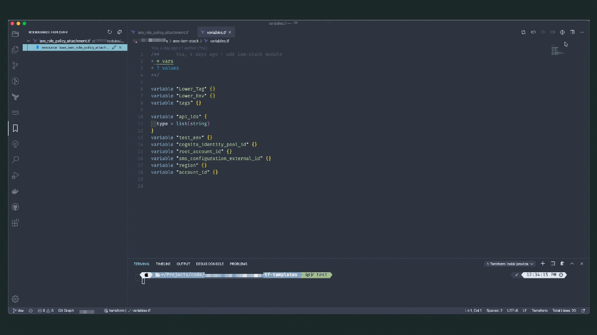
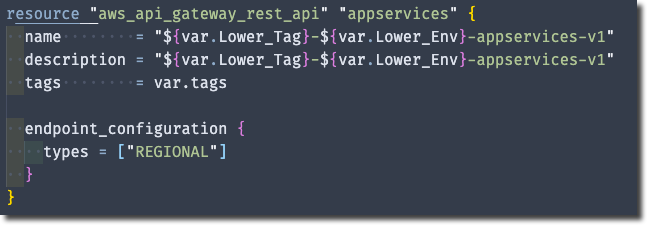
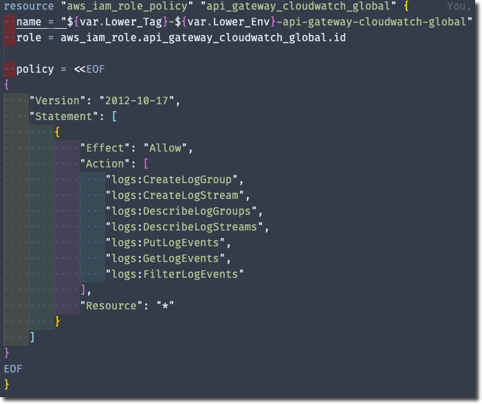

VSCode has become one of the popular Text editor now days, and one of the primary tools for DevOps Engineers to develop their solutions and running tasks. Using Terraform with VSCode can be productive and useful when you check the following 15 VSCode extensions to supercharged your Terraform Development.

## Notes

- If you are new to DevOps and want to setup your MacOS with super powers for DevOps tasks, check my blog post [MacBookPro Setup for DevOps](https://mhmd.io/blog/04-2020/macsetup-devops/), also you can find VSCode section.

- You can use the same approach from AWS Cloud9 IDE, check how to connect VSCode to AWS Cloud 9, and install Terraform in my blog post [How to access AWS Cloud9 IDE from VSCode?](https://mhmd.io/blog/04-2020/cloud9-vscode/)

- Extensions installation methods
  - click on **install** link, or
  - Type cmd + shift + p to launch command palette and choose Extensions: Install Extension. Search for package and install.

---

## Changelog

| Date       | Change       |
| ---------- | ------------ |
| 05-05-2020 | Initial post |

---

## Demo

## 1. Terraform

Syntax highlighting, linting, formatting, and validation for HashiCorp's Terraform

- **[Install](vscode:extension/mauve.terraform)**
- **[Marketplace Link](https://marketplace.visualstudio.com/items?itemName=mauve.terraform)**
- **Publisher**: Mikael Olenfalk

---

## 2. Terraform doc snippets

Terraform code snippets (>3400) straight from documentation for all provider resources and data sources. All providers in the terraform-providers org covered.

- **[Install](vscode:extension/run-at-scale.terraform-doc-snippets)**
- **[Marketplace Link](https://marketplace.visualstudio.com/items?itemName=run-at-scale.terraform-doc-snippets)**
- **Publisher**: Run at Scale

---

## 3. Terraform Autocomplete

Autocomplete for AWS resources with terraform.

- **[Install](vscode:extension/erd0s.terraform-autocomplete)**
- **[Marketplace Link](https://marketplace.visualstudio.com/items?itemName=run-at-scale.terraform-doc-snippets)**
- **Publisher**: erd0s

---

## 4. Dash

Dash, Zeal and Velocity integration in Visual Studio Code.
Dash [_an API Documentation Browser and Code Snippet Manager for MacOS_] documentation integration for Visual Studio Code

- **[Install](vscode:extension/deerawan.vscode-dash)**
- **[Marketplace Link](https://marketplace.visualstudio.com/items?itemName=deerawan.vscode-dash)**
- **Publisher**: Budi Irawan

---

## 5. GitLens — Git supercharged

Supercharge the Git capabilities built into Visual Studio Code — Visualize code authorship at a glance via Git blame annotations and code lens, seamlessly navigate and explore Git repositories, gain valuable insights via powerful comparison commands, and so much more.

- **[Install](vscode:extension/eamodio.gitlens)**
- **[Marketplace Link](https://marketplace.visualstudio.com/items?itemName=eamodio.gitlens)**
- **Publisher**: Eric Amodio

---

## 6. Git Graph

View a Git Graph of your repository, and perform Git actions from the graph.

- **[Install](vscode:extension/mhutchie.git-graph)**
- **[Marketplace Link](https://marketplace.visualstudio.com/items?itemName=mhutchie.git-graph)**
- **Publisher**: mhutchie

---

## 7. gitignore

Language support for .gitignore files. Lets you pull .gitignore files from the <https://github.com/github/gitignore> repository.

- **[Install](vscode:extension/codezombiech.gitignore)**
- **[Marketplace Link](https://marketplace.visualstudio.com/items?itemName=codezombiech.gitignore)**
- **Publisher**: CodeZombie

---

## 8. Todo Tree

Show TODO, FIXME, etc. comment tags in a tree view

- **[Install](vscode:extension/Gruntfuggly.todo-tree)**
- **[Marketplace Link](https://marketplace.visualstudio.com/items?itemName=Gruntfuggly.todo-tree)**
- **Publisher**: Gruntfuggly

---

## 9. Bookmarks

Mark lines and jump to them

- **[Install](vscode:extension/alefragnani.Bookmarks)**
- **[Marketplace Link](https://marketplace.visualstudio.com/items?itemName=alefragnani.Bookmarks)**
- **Publisher**: Alessandro Fragnani

---

## 10. Better Comments

Improve your code commenting by annotating with alert, informational, TODOs, and more!

- **[Install](vscode:extension/aaron-bond.better-comments)**
- **[Marketplace Link](https://marketplace.visualstudio.com/items?itemName=aaron-bond.better-comments)**
- **Publisher**: Aaron Bond

---

## 11. Bracket Pair Colorizer 2

A customizable extension for colorizing matching brackets

- **[Install](vscode:extension/CoenraadS.bracket-pair-colorizer-2)**
- **[Marketplace Link](https://marketplace.visualstudio.com/items?itemName=CoenraadS.bracket-pair-colorizer-2)**
- **Publisher**: CoenraadS

---

## 12. indent-rainbow

Makes indentation easier to read

- **[Install](vscode:extension/oderwat.indent-rainbow)**
- **[Marketplace Link](https://marketplace.visualstudio.com/items?itemName=oderwat.indent-rainbow)**
- **Publisher**: oderwat

---

## 13. Code Spell Checker

Spelling checker for source code

- **[Install](vscode:extension/streetsidesoftware.code-spell-checker)**
- **[Marketplace Link](https://marketplace.visualstudio.com/items?itemName=streetsidesoftware.code-spell-checker)**
- **Publisher**: Street Side Software

---

## 14. Markdown All in One

All you need to write Markdown (keyboard shortcuts, table of contents, auto preview and more)

- **[Install](vscode:extension/yzhang.markdown-all-in-one)**
- **[Marketplace Link](https://marketplace.visualstudio.com/items?itemName=yzhang.markdown-all-in-one)**
- **Publisher**: Yu Zhang

---

## 15. markdownlint

Markdown linting and style checking for Visual Studio Code

- **[Install](vscode:extension/DavidAnson.vscode-markdownlint)**
- **[Marketplace Link](https://marketplace.visualstudio.com/items?itemName=DavidAnson.vscode-markdownlint)**
- **Publisher**: David Anson

---

**_If you feel there are more extensions that we can add to the list, please leave a comment below._**
