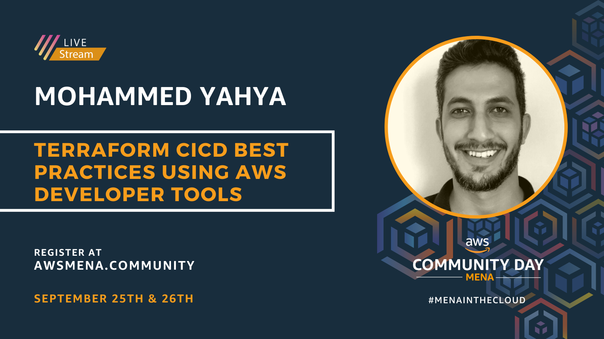

I'm glad to speak at AWS Community Day MENA 2020.

## AWS Community Day MENA

AWS User Groups in MENA are all set to host AWS Community Day MENA 2020 to empower the tech community in the region. User Groups are volunteer-driven groups of passionate developers, architects, users from Amazon Web Services, and students who meet regularly to share best practices, discuss upcoming features and pitfalls in the cloud. AWS User Group in MENA has been meeting at regular intervals throughout the last few years, hosting monthly meetups and running occasional workshops, you can join here https://meetup.com or check other user groups from around MENA here https://awsmena.community.

These are community-organized cloud education events, featuring technical discussions and demos led by expert AWS users and industry leaders from around the world. Supported by a number of sponsors and volunteers, this year AWS Community MENA is set to deliver its first-ever Community Day. With over 1000 attendees from 15 countries. The event will cover a wide variety of talks on serverless, IoT, enterprise adoption, security, Kubernetes, and more. The event will witness the keynotes from Alex Casalboni (https://twitter.com/alex_casalboni) and Ahmed Gouda (https://twitter.com/askgouda).

Be part of the AWS Community Day MENA 2020! To know more details and to get free tickets, head over to https://awsmena.community.

Hashtags:

#AWSCommunityDay
#AWSCommunityDayMENA
#MENAinTheCloud
