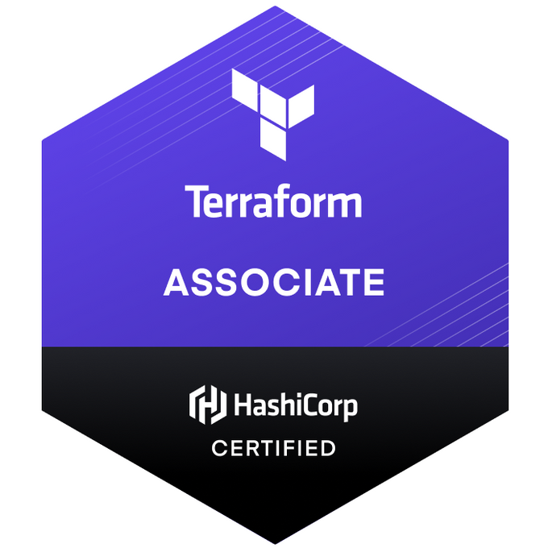

## HashiCorp Certified: Terraform Associate
### Issued by HashiCorp

Earners of the HashiCorp Certified: Terraform Associate certification know the basic concepts, skills, and use cases associated with open source HashiCorp Terraform. They understand and can utilize Terraform according to the certification objectives. Additionally, they understand why enterprises choose to extend Terraform Open Source with Terraform Enterprise to solve business critical objectives.