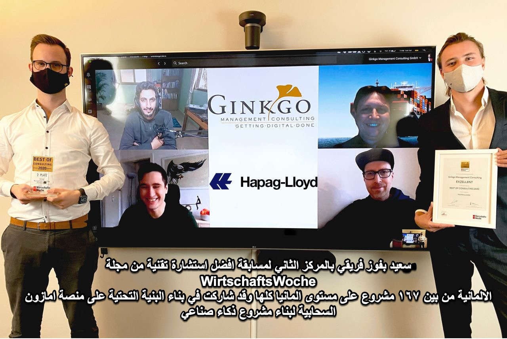

We all hear about the great revolution of modern algorithms aka “Artificial Intelligence” ahead. Still, we see most companies struggle leveraging the benefits of such technologies. Ginkgo Analytics supported Hapag-Lloyd on its journey to their first two productive AI solutions to improve customer service quality. Even more importantly, this left our client with a blueprint for how to get AI done, on which they now base their own AI center of excellence in Gdańsk.

For this enablement we reached 2. place in this years 𝐁𝐞𝐬𝐭 𝐨𝐟 𝐂𝐨𝐧𝐬𝐮𝐥𝐭𝐚𝐧𝐜𝐲 𝐀𝐰𝐚𝐫𝐝 - 𝐓𝐞𝐜𝐡𝐧𝐨𝐥𝐨𝐠𝐲 from WirtschaftsWoche (selected out of 167 projects).

Of course I'm really proud, but I mainly wanted to repost this to thank the whole project team: Marc Schröter, Felix Brilej and Mohammed Yahya from globaldatanet who did the AWS deployment. Lukas Vollmer, Lasse Gosch and Adrian Baetu from Hapag-Lloyd AG who implemented the HL integration.
Another big thank you to Christopher Moritz Arndt who was part of this journey from the very beginning and who summarized the high-level strategy-blueprint as the main part of the WirtschaftsWoche application process!
